## 1. Git 在生产环境中的定位

学习 Git 不需要记住所有命令，更重要的是建立正确的心智模型，并理解团队协作中的安全边界。

实际开发中最重要的是：

- Git 如何记录版本。
- Working Tree、Index、HEAD 分别是什么。
- Branch 和 Commit 的本质是什么。
- `merge` 和 `rebase` 如何影响提交历史。
- 哪些历史可以修改，哪些共享历史不应该修改。
- 如何安全撤销修改。
- 如何解决冲突。
- 如何从误操作中恢复。
- Git 如何与 PR / MR、Code Review、CI 和分支保护共同组成生产工作流。

大型团队常见开发流程如下：

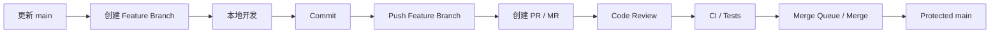

核心原则是：

> Feature Branch 可以在明确边界内整理历史，共享分支优先保证安全、可审计和可恢复。

---

## 2. Git 的三个核心区域

理解 Git 时，可以先建立三个区域的模型：

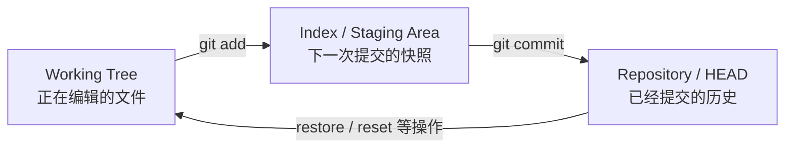

### 2.1 Working Tree

Working Tree 就是当前目录中实际存在并正在编辑的文件。

例如修改：

`src/kernel.c`

可以使用：

```bash
git status
```

查看当前文件状态。

如果文件已经被 Git 跟踪，会看到它处于 `modified` 状态。

---

### 2.2 Index / Staging Area

执行：

```bash
git add src/kernel.c
```

本质上是：

> 将当前版本的 `src/kernel.c` 放入 Index，作为下一次 Commit 的候选内容。

因此完全可能出现以下情况：

1. 修改文件。
2. 执行 `git add`。
3. 再次修改同一个文件。

此时 Index 和 Working Tree 中保存的是不同版本。

查看 Working Tree 与 Index 的差异：

```bash
git diff
```

查看 Index 与 HEAD 的差异：

```bash
git diff --cached
```

因此，`git add` 不应该简单理解成“告诉 Git 我要提交这个文件”。

更准确地说，它是在构造：

> 下一次 Commit 的快照。

---

## 3. HEAD、Branch 和 Commit

### 3.1 HEAD

`HEAD` 表示当前检出的 Git 位置。

正常情况下，HEAD 通常指向一个 Branch，而 Branch 再指向 Commit。

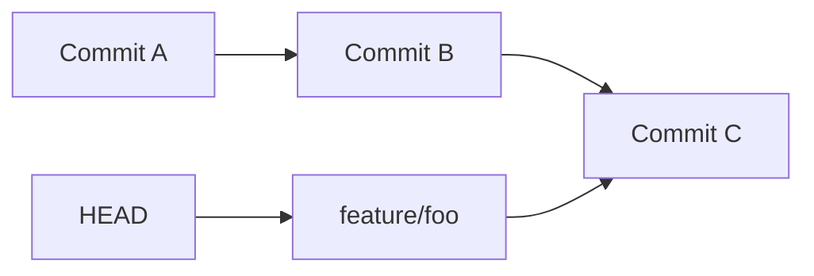

执行新的 Commit 后：

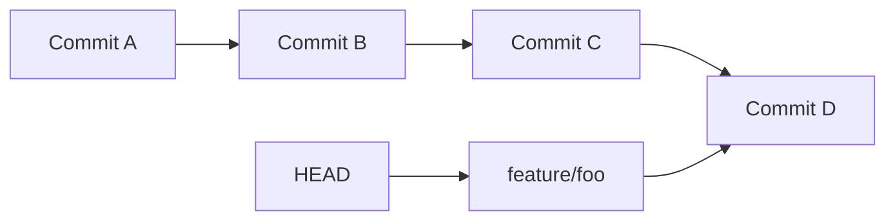

这里并没有修改 Commit C。

Git 实际完成的是：

1. 创建新的 Commit D。
2. Commit D 的 Parent 指向 Commit C。
3. `feature/foo` 移动到 Commit D。

---

### 3.2 Branch 的本质

Git Branch 本质上只是：

> 一个指向 Commit 的可移动引用。

因此创建 Branch 的成本非常低。

```bash
git switch -c experiment
```

并不会复制整个 Repository。

只是创建了一个新的引用。

这也是 Git 可以大量使用短生命周期 Feature Branch 的基础。

---

## 4. Commit 的本质

Git Repository 由一系列对象组成。

常见对象包括：

- blob：文件内容。
- tree：目录及文件结构。
- commit：一次提交。
- tag：标签对象。

一个 Commit 大致记录：

- Tree。
- Parent Commit。
- Author。
- Committer。
- Commit Message。

Commit 之间通过 Parent 组成提交历史。

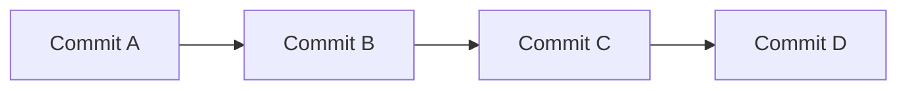

Commit 创建之后可以认为是不可变对象。

如果修改以下内容：

- 文件内容。
- Parent。
- Commit Message。
- Author / Committer 等元数据。

都会产生新的 Commit。

因此：

```bash
git commit --amend
```

并不是修改原来的 Commit，而是创建一个新的 Commit，然后移动当前 Branch。

---

## 5. 为什么 Rebase 会改变 Commit Hash

假设 Commit E 原来基于 Commit B：

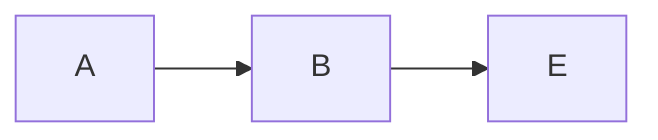

Rebase 后，E 的修改被重新应用到 Commit D：

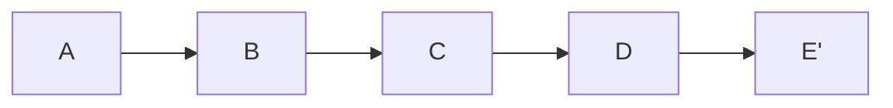

新的 Commit E' 与原来的 Commit E 具有不同 Parent。

由于 Parent 是 Commit 内容的一部分，因此：

> 即使代码修改本身相同，Commit Hash 仍然会变化。

---

## 6. 日常 Feature Branch 工作流

首先更新本地主分支：

```bash
git switch main
git pull --ff-only
```

或者显式执行：

```bash
git fetch origin
git merge --ff-only origin/main
```

然后创建 Feature Branch：

```bash
git switch -c feature/add-kv-cache
```

进行开发。

检查修改：

```bash
git status
git diff
```

构造 Staging Area：

```bash
git add src/foo.cpp
git diff --cached
```

提交：

```bash
git commit
```

推送远程：

```bash
git push -u origin feature/add-kv-cache
```

然后进入 PR / MR、Review 和 CI 流程。

---

## 7. 为什么推荐 `git pull --ff-only`

执行：

```bash
git pull --ff-only
```

表示：

> 如果当前分支无法通过 Fast-forward 更新，则直接失败。

这样可以避免在自己没有意识到的情况下产生额外 Merge Commit。

如果希望更明确地控制同步过程，可以使用：

```bash
git fetch origin
```

然后自己决定使用：

```bash
git merge origin/main
```

还是：

```bash
git rebase origin/main
```

---

## 8. `git fetch` 和 `git pull`

### 8.1 `git fetch`

执行：

```bash
git fetch origin
```

主要作用是更新：

- `origin/main`
- `origin/feature/foo`
- 其他 Remote-tracking Branch

不会直接修改当前 Working Tree。

---

### 8.2 `git pull`

可以理解为两个步骤：

1. Fetch。
2. 将远程修改集成到当前 Branch。

第二步可能采用 Merge，也可能根据 Git 配置采用 Rebase。

查看相关配置：

```bash
git config --get pull.rebase
```

在需要精确控制提交历史时，显式执行 `fetch` 往往更容易理解。

---

## 9. Remote-tracking Branch

`origin/main` 并不是实时访问服务器上的 `main`。

更准确地说，它是：

> 本地记录的远程 Branch 状态。

执行：

```bash
git fetch origin
```

后，它才会根据远程状态更新。

因此：

> 本地的 `origin/main` 并不一定代表服务器这一刻的最新状态。

---

## 10. Commit 应该如何拆分

一个好的 Commit 应尽量表达一个逻辑完整的修改。

例如一次开发同时包含：

- 修复 CUDA Kernel Bug。
- 重构 Allocator。
- 修改 README。
- 格式化大量无关文件。
- 升级依赖。

全部放入一个 Commit，会增加 Review 和回滚难度。

更合理的是根据逻辑拆分。

例如：

```text
fix: handle alignment in cuda allocator
refactor: extract allocation helper
docs: document allocator constraints
```

这里使用 `text` 是因为这是 Commit Message 样例，不是人为绘制的关系图。

是否采用 Conventional Commits 取决于团队规范。

更加通用的原则是：

- Commit 有明确目的。
- Commit 尽量逻辑独立。
- Commit 容易 Review。
- Commit 尽量可以独立 Revert。
- 不要将无关格式化和功能修改混在一起。

---

## 11. `git add -p`

一个文件中可能同时包含多个逻辑修改。

不一定需要整个文件一起加入 Index。

可以使用：

```bash
git add -p
```

Git 会按照 Hunk 逐块询问是否加入 Staging Area。

这非常适合将一次比较杂乱的本地开发整理成多个逻辑清晰的 Commit。

---

## 12. Merge

假设主分支和 Feature Branch 已经产生分叉：

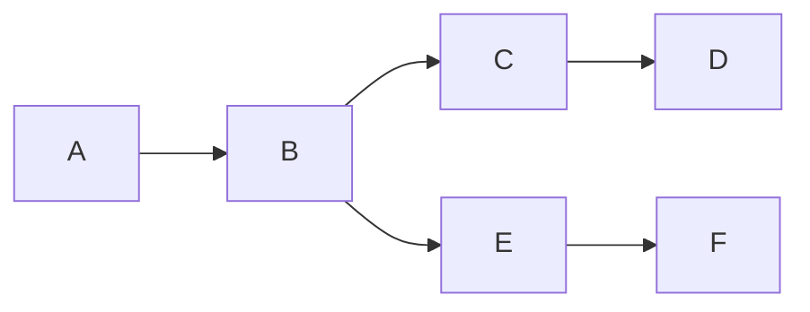

在 Feature Branch 上执行：

```bash
git fetch origin
git merge origin/main
```

可能产生新的 Merge Commit：

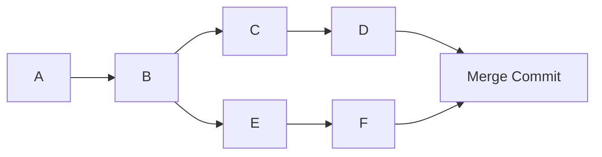

Merge 的特点：

- 保留真实分叉历史。
- 一般不会修改已有 Commit。
- 必要时创建新的 Merge Commit。

因此：

> 对共享历史而言，Merge 通常比改写历史更加安全。

---

## 13. Rebase

假设：


在 Feature Branch 上执行：

```bash
git fetch origin
git rebase origin/main
```

会把 Feature Branch 上的 Commit 重新应用到新的 Base：

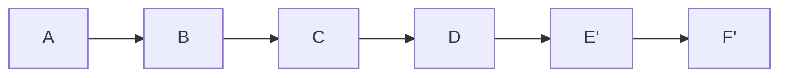

注意：

- `E'` 不是原来的 E。
- `F'` 不是原来的 F。
- Commit Hash 会改变。

Rebase 本质上是在：

> 将一系列 Commit 重新应用到新的 Base。

---

## 14. Merge 和 Rebase 的使用边界

| 场景 | 常见做法 |
|---|---|
| 自己本地的 Feature Branch | 可以 Rebase |
| 自己独占的远程 Feature Branch | 可以根据团队规则 Rebase |
| 多人共享 Feature Branch | 谨慎 Rebase |
| `main` 等共享 Branch | 不随意 Rebase |
| 已经被其他开发者依赖的 Commit | 不随意重写 |
| 整理自己 PR 的 Commit | Interactive Rebase 很合适 |

核心原则：

> 不要随意 Rebase 已经被其他开发者依赖的公开历史。

---

## 15. Interactive Rebase

整理当前 Feature Branch：

```bash
git rebase -i origin/main
```

可能看到：

```text
pick a111111 implement allocator
pick b222222 fix typo
pick c333333 fix allocator bug
pick d444444 another typo
```

可以修改为：

```text
pick a111111 implement allocator
fixup b222222 fix typo
fixup c333333 fix allocator bug
fixup d444444 another typo
```

常见操作：

| 操作 | 作用 |
|---|---|
| `pick` | 保留 Commit |
| `reword` | 修改 Commit Message |
| `edit` | 停下来修改 Commit |
| `squash` | 合并 Commit，并编辑 Message |
| `fixup` | 合并 Commit，并丢弃当前 Message |
| `drop` | 删除 Commit |

Interactive Rebase 非常适合整理尚未进入共享历史的 Feature Branch。

---

## 16. Squash Merge

Feature Branch 中可能包含多个开发过程 Commit：

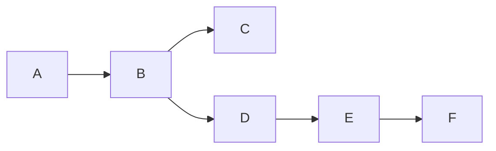

如果平台最终采用 Squash Merge，可以将 Feature Branch 的最终修改合成一个新 Commit：

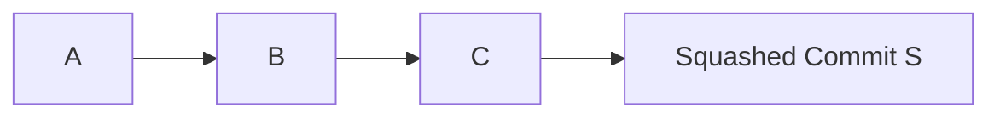

优点：

- 主分支历史较简洁。
- 一个 PR 可以对应一个 Commit。
- 整体回滚一个 PR 比较方便。

缺点：

- Feature Branch 中原本的 Commit 粒度不会保留到主分支。

具体采用 Merge Commit、Squash Merge 还是 Rebase Merge，应遵循 Repository Policy。

---

## 17. Fast-forward

假设：

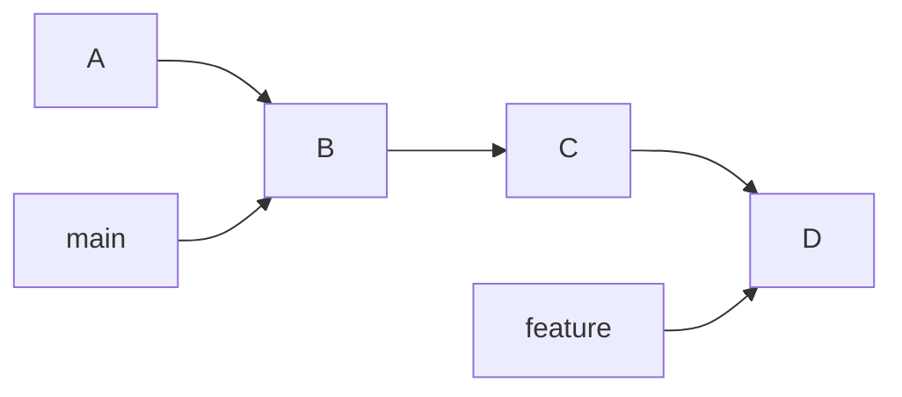

由于 `main` 从 B 到 D 之间没有其他分叉修改，因此合并 Feature Branch 时，只需要让 `main` 指针移动到 D。

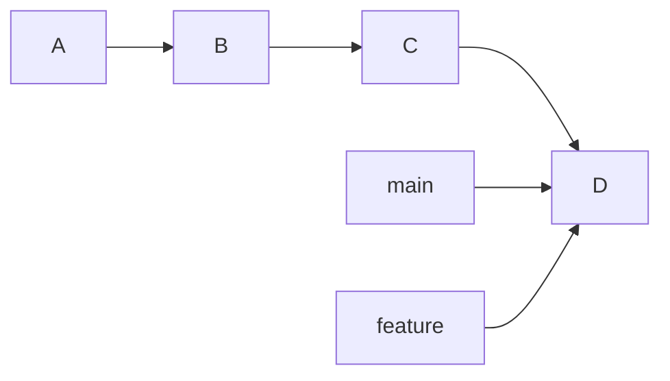

这种合并称为 Fast-forward。

没有创建新的 Merge Commit。

---

## 18. `--no-ff`

即使当前可以 Fast-forward，也可以使用：

```bash
git merge --no-ff feature
```

强制创建 Merge Commit。

作用之一是：

> 在历史中明确保留某次 Feature Branch 合并边界。

是否采用这种策略取决于团队规范。

---

## 19. Three-way Merge 和 Merge Base

假设两个 Branch 从同一个 Commit 分叉：


Merge 时 Git 不只是比较 D 和 F。

还需要找到共同祖先 B，也就是 Merge Base。

Git 根据：

- Merge Base B。
- Branch 一侧 D。
- Branch 另一侧 F。

执行 Three-way Merge。

Merge Base 用于判断：

> 哪些内容是在分叉之后分别被两侧修改的。

---

## 20. Conflict

假设 Base 中：

```cpp
int block_size = 128;
```

一个 Branch 改成：

```cpp
int block_size = 256;
```

另一个 Branch 改成：

```cpp
int block_size = 512;
```

Git 无法自动判断最终结果，可能产生：

```text
<<<<<<< HEAD
int block_size = 256;
=======
int block_size = 512;
>>>>>>> feature
```

Conflict 并不代表 Git 出错。

真正含义是：

> Git 无法自动确定最终代码的正确语义，需要人工判断。

---

## 21. Merge Conflict 处理

首先检查：

```bash
git status
```

修改冲突文件。

解决完成后：

```bash
git add <file>
```

然后根据状态继续：

```bash
git merge --continue
```

某些情况下也可以通过 Commit 完成 Merge。

如果希望完全放弃：

```bash
git merge --abort
```

---

## 22. Rebase Conflict

执行：

```bash
git rebase origin/main
```

发生冲突后：

```bash
git status
```

解决文件：

```bash
git add <file>
git rebase --continue
```

放弃整个 Rebase：

```bash
git rebase --abort
```

Rebase 是逐个重新应用 Commit。

因此一次 Rebase 中可能连续遇到多轮 Conflict。

---

## 23. Conflict Resolution 是语义问题

不要把 Conflict Resolution 简单理解成：

- Accept Current。
- Accept Incoming。

例如一个 Branch 修改 Tensor Layout，另一个 Branch 修改 CUDA Kernel Indexing。

即使文本能够成功合并，也可能产生语义错误。

因此解决冲突后，应根据项目情况重新执行：

- Unit Test。
- Integration Test。
- Build。
- Static Analysis。
- Relevant Benchmark。

---

## 24. `git reset`

`reset` 的核心作用之一是移动当前 Branch / HEAD。

假设：

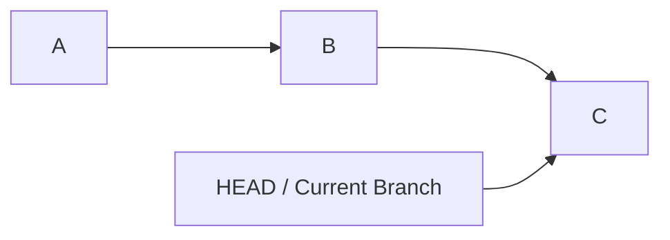

执行将当前 Branch Reset 到 B 后：

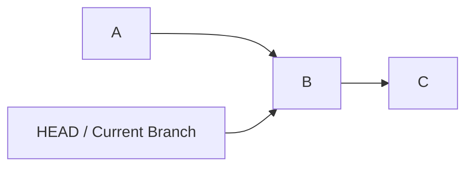

Commit C 并不一定立即消失。

只是当前 Branch 不再指向它。

---

## 25. `reset --soft`

```bash
git reset --soft HEAD~1
```

效果：

- HEAD 后退。
- Index 保持不变。
- Working Tree 保持不变。

适合：

> 撤销本地 Commit，但仍然保持修改处于 Staged 状态。

---

## 26. `reset --mixed`

默认的：

```bash
git reset HEAD~1
```

相当于：

```bash
git reset --mixed HEAD~1
```

效果：

- HEAD 后退。
- Index 回退。
- Working Tree 保留。

Commit 被撤销后，修改重新成为 Unstaged Changes。

---

## 27. `reset --hard`

```bash
git reset --hard HEAD~1
```

会同时影响：

- HEAD。
- Index。
- Working Tree。

因此未提交的 Tracked 文件修改可能直接被覆盖。

使用之前最好先确认：

```bash
git status
```

不要养成“仓库状态不对就直接 `reset --hard`”的习惯。

---

## 28. `git revert`

假设提交历史：

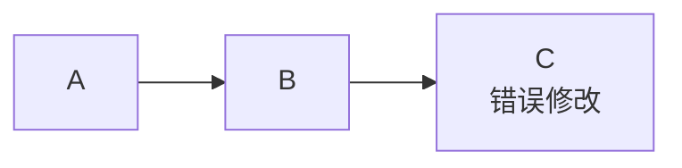

执行：

```bash
git revert C
```

Git 不会删除 C。

而是创建新的 Commit D：

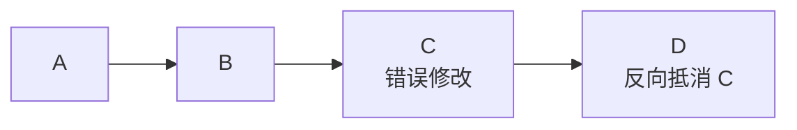

因此：

> 已经进入共享分支的错误修改通常优先通过 Revert 撤销，而不是修改已有历史。

---

## 29. Reset 和 Revert 的使用区别

| 场景 | 常见做法 |
|---|---|
| 本地 Commit，尚未共享 | 可以考虑 `reset` |
| 本地历史需要重新组织 | `reset` / `rebase` |
| 已进入公共 Branch | 优先 `revert` |
| 主分支线上出现错误修改 | Revert 对应 Commit / PR |
| 需要保留完整审计历史 | `revert` |

可以概括为：

> 本地私有历史可以整理，共享历史优先通过新增 Commit 修复。

---

## 30. `git restore`

放弃 Working Tree 中某个 Tracked 文件的修改：

```bash
git restore src/foo.cpp
```

取消 Staged：

```bash
git restore --staged src/foo.cpp
```

两者区别很重要。

`git restore --staged` 只是修改 Index。

Working Tree 中的修改仍然存在。

而：

```bash
git restore src/foo.cpp
```

可能直接覆盖尚未 Commit 的文件修改。

---

## 31. `git commit --amend`

修改最近一次 Commit：

```bash
git commit --amend
```

典型用途：

- Commit Message 写错。
- 漏掉一个文件。
- 将一个很小的修复加入上一 Commit。

例如：

```bash
git add missing_file.cpp
git commit --amend
```

需要注意：

> Amend 会创建新的 Commit，因此 Commit Hash 会改变。

---

## 32. Force Push

普通：

```bash
git push
```

会阻止很多 Non-fast-forward 更新。

而：

```bash
git push --force
```

允许直接修改远程 Branch 引用。

风险是：

> 可能覆盖其他开发者刚刚推送的 Commit。

如果确实需要改写自己的远程 Feature Branch，更常使用：

```bash
git push --force-with-lease
```

它会检查远程 Branch 是否仍然处于自己预期的位置。

如果远程 Branch 已经发生变化，Push 通常会失败。

但 `--force-with-lease` 仍然属于：

> 改写远程历史。

因此不能把它理解成无条件安全。

---

## 33. Rebase 后为什么经常需要 Force Push

假设远程 Feature Branch：

```mermaid
flowchart LR
    A["A"] --> B["B"]
    B --> E["E"]
    E --> F["F"]
```

Rebase 后，本地变成：

```mermaid
flowchart LR
    A["A"] --> B["B"]
    B --> C["C"]
    C --> D["D"]
    D --> E2["E'"]
    E2 --> F2["F'"]
```

由于原来的 E、F 和新的 E'、F' 是不同 Commit，因此无法通过普通 Fast-forward Push 替换远程历史。

如果该 Branch 明确允许重写，可以使用：

```bash
git push --force-with-lease
```

---

## 34. Cherry-pick

执行：

```bash
git cherry-pick <commit>
```

作用是：

> 将某个已有 Commit 引入的修改应用到当前 Branch，并创建一个新的 Commit。

例如：

```mermaid
flowchart LR
    A["A"] --> B["B"]
    B --> C["C<br/>Bugfix"]
    B --> R["release branch"]
```

在 Release Branch 上 Cherry-pick C 后：

```mermaid
flowchart LR
    A["A"] --> B["B"]
    B --> C["C<br/>Bugfix on main"]
    B --> C2["C'<br/>Cherry-picked Bugfix"]
```

C' 与 C 的修改可能相同，但 Parent 不同，因此 Commit Hash 不同。

---

## 35. Cherry-pick 的常见用途

典型场景包括：

- Release Branch Backport。
- Hotfix。
- 将一个独立 Bugfix 移植到另一个 Branch。

不适合将 Cherry-pick 作为长期 Branch 同步机制。

如果两个长期 Branch 不断互相 Cherry-pick，提交历史会逐渐变得难以理解。

---

## 36. Revert Merge Commit

Merge Commit 有多个 Parent。

例如：

```mermaid
flowchart LR
    A["A"] --> B["B"]
    B --> C["C"]
    C --> D["D"]
    B --> E["E"]
    E --> F["F"]
    D --> M["Merge Commit M"]
    F --> M
```

如果需要 Revert M，可能使用：

```bash
git revert -m 1 <merge_commit>
```

`-m 1` 用于告诉 Git：

> 哪一个 Parent 应当被视为 Mainline。

不要机械记忆数字。

应该根据具体 Parent 关系判断。

---

## 37. `git reflog`

Reflog 是本地误操作恢复中非常重要的工具。

例如错误执行：

```bash
git reset --hard HEAD~3
```

可以查看：

```bash
git reflog
```

可能看到：

```text
82ad123 HEAD@{0}: reset: moving to HEAD~3
91bc456 HEAD@{1}: commit: add cuda graph support
ae21890 HEAD@{2}: commit: refactor scheduler
```

如果确认 `91bc456` 是需要恢复的位置，可以先创建恢复 Branch：

```bash
git switch -c recovery 91bc456
```

这种做法通常比直接再次 Hard Reset 更保守。

---

## 38. Reflog 为什么能够恢复很多误操作

很多 Git 操作实际上只是移动引用。

例如 Reset 前：

```mermaid
flowchart LR
    A["A"] --> B["B"]
    B --> C["C"]
    C --> D["D"]
    H["Branch"] --> D
```

Reset 后：

```mermaid
flowchart LR
    A["A"] --> B["B"]
    B --> C["C"]
    C --> D["D"]
    H["Branch"] --> B
```

D 并不会立即被物理删除。

Reflog 又记录了引用曾经的位置，因此可以找到原 Commit。

需要注意：

> Reflog 是本地恢复机制，不能代替远程备份和正常的协作流程。

---

## 39. `git stash`

临时保存当前修改：

```bash
git stash push -m "wip scheduler"
```

查看：

```bash
git stash list
```

恢复：

```bash
git stash pop
```

Stash 适合：

> 临时切换上下文。

不适合长期保存大量开发工作。

如果工作需要持续较长时间，创建临时 Branch 并 Commit 往往更容易管理。

---

## 40. `git worktree`

如果需要同时维护多个工作目录，可以使用：

```bash
git worktree add ../repo-hotfix main
```

此时可以同时拥有：

- 原目录处理 Feature。
- 新目录处理 Hotfix。

对于 AI Infra 开发尤其有用，例如：

- 一个 Worktree 编译新实现。
- 一个 Worktree 保持 Baseline。
- 一个 Worktree 跑 Benchmark。
- 一个 Worktree 处理紧急修复。

这样可以避免频繁 Stash 和切换 Branch。

---

## 41. 常用历史查看命令

查看历史：

```bash
git log --oneline --graph --decorate --all
```

查看某个文件的历史：

```bash
git log -- path/to/file
```

查看某次 Commit：

```bash
git show <commit>
```

比较两个 Commit：

```bash
git diff <commit1> <commit2>
```

比较当前 Branch 相对主分支的整体修改：

```bash
git diff origin/main...HEAD
```

---

## 42. `git blame`

查看文件中每一行最近对应的 Commit：

```bash
git blame src/foo.cpp
```

它的主要工程用途不是寻找责任人。

更有价值的用途是：

> 找到某段代码对应的历史上下文。

推荐排查流程：

```mermaid
flowchart TD
    A["git blame"] --> B["定位相关 Commit"]
    B --> C["git show"]
    C --> D["查看 Commit 修改背景"]
    D --> E["结合 PR / Issue / Design Context"]
```

---

## 43. `git bisect`

Bisect 可以通过二分方式定位引入问题的 Commit。

假设：

```mermaid
flowchart LR
    A["A<br/>Good"] --> B["B"]
    B --> C["C"]
    C --> D["D"]
    D --> E["E"]
    E --> F["F"]
    F --> G["G<br/>Bad"]
```

开始：

```bash
git bisect start
git bisect bad
git bisect good <good-commit>
```

然后根据当前 Commit 的测试结果不断执行：

```bash
git bisect good
```

或者：

```bash
git bisect bad
```

如果测试能够自动化，可以使用：

```bash
git bisect run ./test.sh
```

非常适合定位：

- Kernel Correctness Regression。
- Compilation Failure。
- Latency Regression。
- Memory Regression。
- Runtime Crash。

---

## 44. Detached HEAD

正常情况下：

```mermaid
flowchart LR
    C["Commit C"]
    B["Branch"] --> C
    H["HEAD"] --> B
```

Detached HEAD 状态下：

```mermaid
flowchart LR
    C["Commit C"]
    H["HEAD"] --> C
```

此时仍然可以创建 Commit，但新 Commit 不一定有 Branch 长期引用。

如果需要保留实验结果，可以创建 Branch：

```bash
git switch -c experiment
```

---

## 45. Tag

创建 Annotated Tag：

```bash
git tag -a v1.2.0 -m "release v1.2.0"
```

推送：

```bash
git push origin v1.2.0
```

Tag 常用于：

- Release Version。
- Build Version。
- Container Image Version。
- Deployment Provenance。

具体发布体系是否基于 Tag，由项目的 CI/CD 设计决定。

---

## 46. Protected Main

生产 Repository 通常不会让所有开发者自由修改主分支。

常见限制包括：

- 禁止直接 Push 到 `main`。
- 必须通过 PR / MR。
- 必须完成 Code Review。
- CI 必须通过。
- 某些目录需要 Code Owner 审批。
- 禁止 Force Push。
- 禁止删除主分支。
- 合并前必须满足 Repository Rules。

这些规则的目的不是限制 Git 功能，而是控制：

> 哪些 Git 历史修改能够进入共享主干。

---

## 47. PR / MR 工作流

典型流程：

```mermaid
flowchart TD
    A["Developer Push Feature Branch"] --> B["Create PR / MR"]
    B --> C["CI Runs"]
    B --> D["Code Review"]
    D --> E{"需要修改？"}
    E -->|"Yes"| F["Update Feature Branch"]
    F --> C
    F --> D
    E -->|"No"| G{"Required Checks Passed?"}
    C --> G
    G -->|"No"| F
    G -->|"Yes"| H["Merge Queue / Merge"]
    H --> I["main"]
```

生产代码管理通常由多部分组成：

- Git。
- PR / MR。
- Code Review。
- CI。
- Branch Protection。
- CODEOWNERS。
- Merge Policy。
- Release System。

Git 是其中最底层的版本控制机制。

---

## 48. Merge Queue / Merge Train

两个 PR 单独基于当前 `main` 测试通过，并不能保证它们组合后仍然通过。

```mermaid
flowchart TD
    A["main + PR A"] --> A1["CI Pass"]
    B["main + PR B"] --> B1["CI Pass"]
    A1 --> C["main + A + B"]
    B1 --> C
    C --> D{"仍然通过？"}
```

因此高并发仓库可能引入 Merge Queue / Merge Train。

```mermaid
flowchart LR
    A["PR A"] --> Q["Merge Queue"]
    B["PR B"] --> Q
    C["PR C"] --> Q
    Q --> T1["Validate main + A"]
    T1 --> T2["Validate main + A + B"]
    T2 --> T3["Validate main + A + B + C"]
    T3 --> M["main"]
```

目标是：

> 在 Commit 真正进入主干之前验证排队后的组合结果。

---

## 49. Feature Branch 应尽量短生命周期

Feature Branch 存活时间越长：

- 与 Main 的差异越大。
- Conflict 越多。
- Integration Risk 越高。
- Review 越困难。

因此很多生产环境倾向使用：

- Protected Main。
- Short-lived Feature Branch。
- PR / MR。
- Continuous Integration。

Release Branch、Hotfix Branch 是否长期存在，则根据项目发布模型决定。

---

## 50. 生产 Hotfix

如果错误 Commit 已经进入生产环境，首要目标通常是恢复服务。

典型过程：

```mermaid
flowchart LR
    A["Bad Commit Reaches Production"] --> B["Revert"]
    B --> C["Restore Stable State"]
    C --> D["Root Cause Analysis"]
    D --> E["Implement Proper Fix"]
    E --> F["Add Regression Test"]
    F --> G["Deploy Again"]
```

因此：

> Revert 只是恢复稳定状态，不一定是最终 Bugfix。

---

## 51. `.gitignore`

如果文件从未被 Track，例如：

`build/output.bin`

可以通过 `.gitignore`：

```gitignore
build/
```

让 Git 默认忽略。

但是：

> `.gitignore` 不会让已经被 Track 的文件自动停止跟踪。

如果文件已经进入 Repository，需要：

```bash
git rm --cached build/output.bin
```

然后 Commit。

---

## 52. 大文件管理

AI Infra 项目中特别要注意：

- Model Checkpoint。
- Dataset。
- Benchmark Output。
- 大型 Binary。
- Core Dump。
- Profiling Trace。

不适合直接作为普通 Git 对象长期 Commit。

原因之一是：

> 文件从当前版本删除，并不意味着其历史 Blob 自动消失。

更适合根据基础设施使用：

- Object Storage。
- Artifact Repository。
- Dataset Management System。
- Model Registry。
- Git LFS。

---

## 53. Secret 不应进入 Git

不要 Commit：

- API Key。
- Cloud Credential。
- SSH Private Key。
- Access Token。
- Production Password。

如果 Secret 已经 Push 到远程 Repository，不应该只考虑如何删除 Git Commit。

正确处理顺序通常是：

```mermaid
flowchart LR
    A["Secret Pushed"] --> B["Revoke / Rotate Credential"]
    B --> C["Assess Exposure"]
    C --> D["Clean Repository History if Required"]
    D --> E["Improve Secret Scanning / Workflow"]
```

因为 Secret 可能已经进入：

- Remote Repository。
- Developer Clone。
- CI Log。
- Cache。
- Mirror。
- Audit System。

---

## 54. Submodule

初始化：

```bash
git submodule update --init --recursive
```

Submodule 的核心模型是：

> 主 Repository 记录另一个 Repository 的特定 Commit。

常见问题包括：

- Clone 后忘记初始化。
- Submodule Pointer 变化。
- Nested Submodule。
- CI 没有递归 Checkout。

在大型 C++ / CUDA 项目中可能遇到，但日常只需要先理解基本机制。

---

## 55. Monorepo

大型 Monorepo 可能面临：

- Repository 体积很大。
- Clone / Fetch 成本高。
- CI 范围巨大。
- 大量团队同时修改 Main。
- Merge 并发很高。

可能结合：

- Sparse Checkout。
- Partial Clone。
- Path-based CI。
- CODEOWNERS。
- Merge Queue。
- Repository Rules。

这些机制主要解决大规模协作和仓库性能问题。

---

## 56. `git clean`

预览将被删除的 Untracked 文件：

```bash
git clean -n
```

真正删除：

```bash
git clean -f
```

包含目录：

```bash
git clean -fd
```

使用时需要特别谨慎，因为：

> Untracked 文件通常没有 Git 历史可以恢复。

因此应该优先执行：

```bash
git clean -n
```

确认删除范围。

---

## 57. 一套完整 Feature 开发流程

更新主分支：

```bash
git switch main
git pull --ff-only
```

创建 Feature Branch：

```bash
git switch -c feature/scheduler-batching
```

开发并检查：

```bash
git status
git diff
```

整理 Staging Area：

```bash
git add -p
git diff --cached
```

Commit：

```bash
git commit
```

准备同步 Main：

```bash
git fetch origin
git rebase origin/main
```

发生冲突时：

```bash
git status
git add <resolved-files>
git rebase --continue
```

需要整理 Commit 时：

```bash
git rebase -i origin/main
```

首次 Push：

```bash
git push -u origin feature/scheduler-batching
```

如果之前已经 Push，并且明确允许改写自己的 Feature Branch：

```bash
git push --force-with-lease
```

然后进入：

```mermaid
flowchart LR
    A["PR / MR"] --> B["CI"]
    B --> C["Code Review"]
    C --> D["Update if Needed"]
    D --> B
    C --> E["Merge"]
    E --> F["Delete Feature Branch"]
```

---

## 58. Review 过程中如何处理临时 Commit

Review 阶段可能产生：

```text
implement scheduler
fix typo
address review
fix test
rename helper
```

这些只是 Commit Message 示例，因此保留为原样文本。

如果团队希望合入前整理历史，可以使用：

```bash
git rebase -i origin/main
```

最终整理成逻辑更明确的 Commit。

是否需要 Squash，应遵循 Repository Policy，而不是机械要求所有 PR 都压成一个 Commit。

---

## 59. Upstream 开源项目工作流

参与 PyTorch、vLLM、LLVM 或其他开源项目时，经常会使用 Fork + Upstream 模式。

```mermaid
flowchart TD
    A["Upstream Repository"] --> B["Fork"]
    B --> C["Local Repository"]
    C --> D["Feature Branch"]
    A -->|"fetch upstream"| C
    D -->|"rebase upstream/main"| E["Updated Feature Branch"]
    E --> F["Push to Fork"]
    F --> G["Create Pull Request to Upstream"]
```

常见 Remote：

```bash
git remote -v
```

通常：

- `origin` 指向自己的 Fork。
- `upstream` 指向原始项目。

同步：

```bash
git fetch upstream
git rebase upstream/main
```

---

## 60. Backport

项目可能同时维护：

- `main`
- `release/1.0`
- `release/1.1`

例如 Bugfix 首先进入 `main`：

```mermaid
flowchart LR
    A["main"] --> B["Bugfix Commit"]
    B --> C["Cherry-pick"]
    C --> D["release/1.1"]
    C --> E["release/1.0"]
```

可以根据 Release Policy 将修复 Cherry-pick 到旧版本。

---

## 61. AI Infra 场景中的 Git 使用

### 61.1 大型 C++ / CUDA Repository

常用：

```bash
git log -- path/to/kernel.cu
git blame path/to/kernel.cu
git show <commit>
```

用于分析历史代码和设计上下文。

---

### 61.2 Performance Regression

可以结合 Benchmark 与：

```bash
git bisect
```

定位性能 Regression 对应的 Commit。

---

### 61.3 多版本实验

可以使用：

```bash
git worktree
```

同时保持：

- Baseline。
- 新优化版本。
- Hotfix。
- Benchmark Branch。

减少频繁切换 Branch 的成本。

---

## 62. 常见误操作恢复

| 情况 | 常见处理 |
|---|---|
| 修改文件后想取消 | `git restore <file>` |
| Staged 错文件 | `git restore --staged <file>` |
| Commit Message 写错 | `git commit --amend` |
| 漏文件到上一 Commit | `git add` 后 `git commit --amend` |
| 本地 Commit 不想保留，但需要保留修改 | `git reset HEAD~1` |
| 本地 Commit 和修改都不要 | 谨慎使用 `git reset --hard HEAD~1` |
| 公共 Branch 出现错误 Commit | `git revert` |
| Rebase 做错 | `git rebase --abort` 或 `git reflog` |
| Merge 做错 | `git merge --abort` |
| Reset 到错误位置 | `git reflog` |
| Branch 被误删 | 根据 Commit / Reflog 恢复 |

误操作后不要连续执行大量不理解的恢复命令。

优先检查：

```bash
git status
git log --oneline --graph --decorate --all
git reflog
```

先明确当前 Repository 状态。

---

## 63. 推荐形成肌肉记忆的命令

### Repository 状态

```bash
git status
git diff
git diff --cached
git log --oneline --graph --decorate --all
```

### Branch

```bash
git branch
git switch main
git switch -c feature/foo
```

### Commit

```bash
git add <file>
git add -p
git commit
git commit --amend
```

### Remote

```bash
git fetch origin
git pull --ff-only
git push
git push -u origin <branch>
git push --force-with-lease
```

### History

```bash
git merge <branch>
git rebase origin/main
git rebase -i origin/main
git cherry-pick <commit>
```

### Conflict

```bash
git status
git merge --abort
git rebase --continue
git rebase --abort
```

### Undo

```bash
git restore <file>
git restore --staged <file>
git reset HEAD~1
git reset --soft HEAD~1
git reset --hard HEAD~1
git revert <commit>
git reflog
```

### Debug

```bash
git show <commit>
git blame <file>
git bisect start
```

---

## 64. 学习优先级

建议按照下面的层次逐渐深入：

```mermaid
flowchart TD
    A["Git Mental Model"] --> B["Branch / Commit"]
    B --> C["Merge / Rebase"]
    C --> D["Conflict Resolution"]
    D --> E["Reset / Revert / Reflog"]
    E --> F["PR / CI Workflow"]
    F --> G["History Debugging"]
    G --> H["Advanced Git"]
```

当前不需要优先深入：

- Git Plumbing Commands。
- `git filter-branch`。
- 复杂 Refspec。
- Git Notes。
- Replace Refs。
- Bundle。
- Mail-based Patch Workflow。
- 大量冷门 Merge Strategy 参数。

这些功能并非没有价值，而是日常生产开发中的使用频率相对较低。

---

## 65. 最终心智模型

可以把 Git 分成四层理解：

```mermaid
flowchart TD
    A["Immutable Git Objects"] --> B["Commit DAG"]
    B --> C["Mutable References<br/>Branch / HEAD"]
    C --> D["Working Tree + Index"]
    D --> E["Developer Operations<br/>add / commit / merge / rebase / reset"]
    E --> F["PR / MR"]
    F --> G["Review + CI"]
    G --> H["Protected Main"]
```

最底层：

> Git 保存对象和 Commit Graph。

中间：

> Branch、HEAD 等 Reference 在 Commit Graph 上移动。

开发者操作：

> `add`、`commit`、`merge`、`rebase`、`reset` 等操作修改 Index、创建 Commit 或移动 Reference。

生产协作：

> PR / MR、CI、Review、Branch Protection 决定哪些修改可以进入共享历史。

理解这套模型之后，即使忘记某个具体 Git 参数，也可以根据操作目标快速判断应该查询和使用哪类命令。
